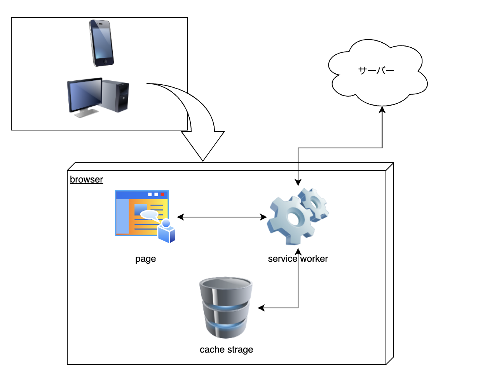

# PWA(プログレッシブウェブアプリ)について自己理解する

## PWA とは

PWA とは一言で言うとネイティブアプリのように使用できるウェブアプリのことです。つまりウェブアプリでありながら、ホーム画面のアイコンから起動でき、携帯端末などにおいて以下の機能が使用できます。

- プッシュ通知
- カメラ
- マイク入力
- オーディオ出力
- GPS
- 生体認証
- Bluetooth
- 音声認識

これはスマホアプリを作るほどのコストを割けない場合や、アプリ程多機能である必要がないケースに向いています。例えば以下の例のようなケースであれば、PWA が効果を発揮するでしょう。

- ホーム画面に追加してもらい、ユーザーとの接触を増やしたい
- Web サイトの表示速度を改善したい
- オフライン機能を追加したい
  ただし、現状 iPhone ユーザーの多い日本では、機能が制限される可能性があるので注意が必要

また、ネイティブアプリと比較して以下のような違いがあリます。

|                      | PWA  | ネイティブ |
| -------------------- | ---- | ---------- |
| ダウンロードの必要性 | なし | あり       |
| 更新の必要性         | なし | あり       |
| ストアの審査         | なし | あり       |

## PWA にするために

PWA は一言で言うとネイティブアプリのように使用できるウェブアプリと言いましたが、実際の定義ではウェブアプリの中でも特定の要素を満たしている場合に PWA であるとみなされるようです。

つまり単一の技術で成り立っているわけではなく、特定要素を満たすために様々な技術が用いられます。

### PWA であるための要素 (参考 [MDN web docs](https://developer.mozilla.org/ja/docs/Web/Progressive_web_apps/Tutorials/js13kGames/Introduction))

- 発見可能: 検索エンジンで見つけることができる。
- リンク可能: URL を送るだけでアプリを共有できる。
- ネットワーク非依存: オフライン、または貧弱なネットワーク環境でも使用できる。
- 進化的: 古いブラウザーでも基本的な機能は使用でき、最新のブラウザーではすべての機能が使用できる。
- レスポンシブデザイン: 携帯電話やタブレット、ノートパソコンなど、画面とブラウザを備える全ての端末で使用できる。
- 安全性: アプリからの通信が第三者からの攻撃に対して安全であり、機密情報を保護できる。
- インストール可能: アプリを端末のホーム画面に追加できる。
- 再エンゲージ可能: 新しいコンテンツがあるときに通知を送ることができる。

## 仕組み

Service Worker

- os に作用されない
- push 通知
- 通信量が少ない, 読み込みが早い
- アプリストアからのインストールが不要
- 企業は Android/iOS のネイティブアプリを別に開発する必要が無くなる

### 使える機能

